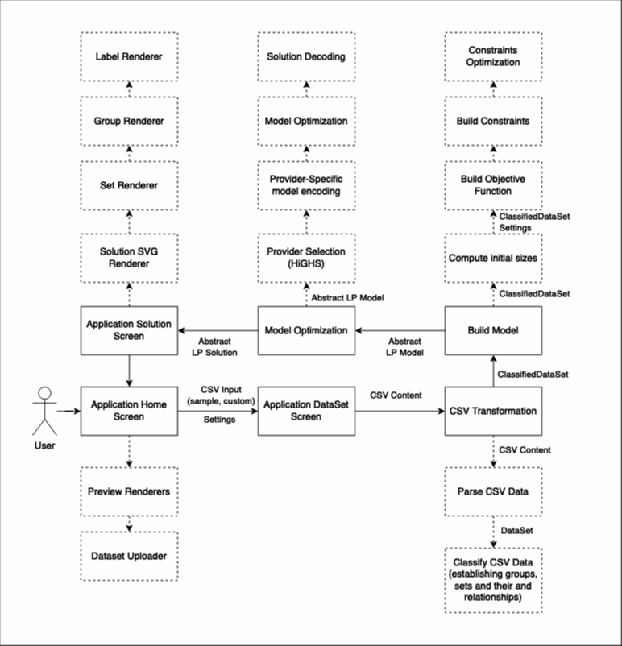
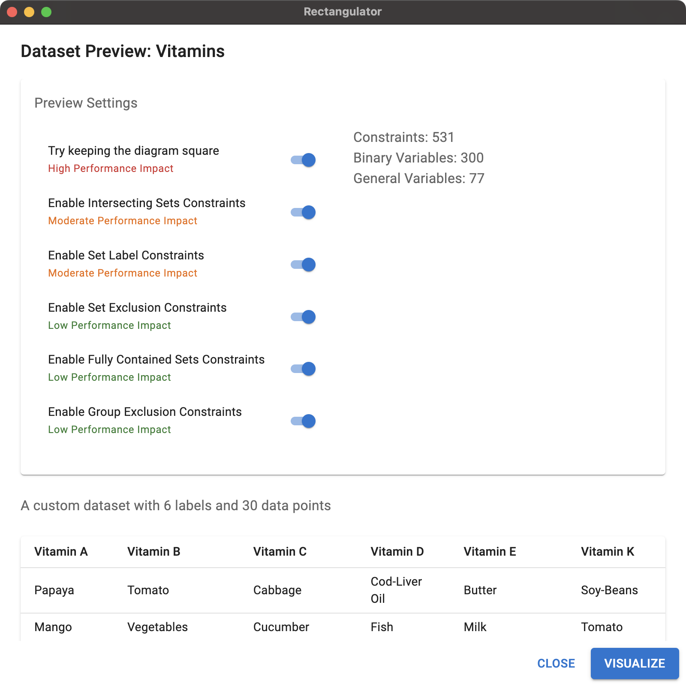
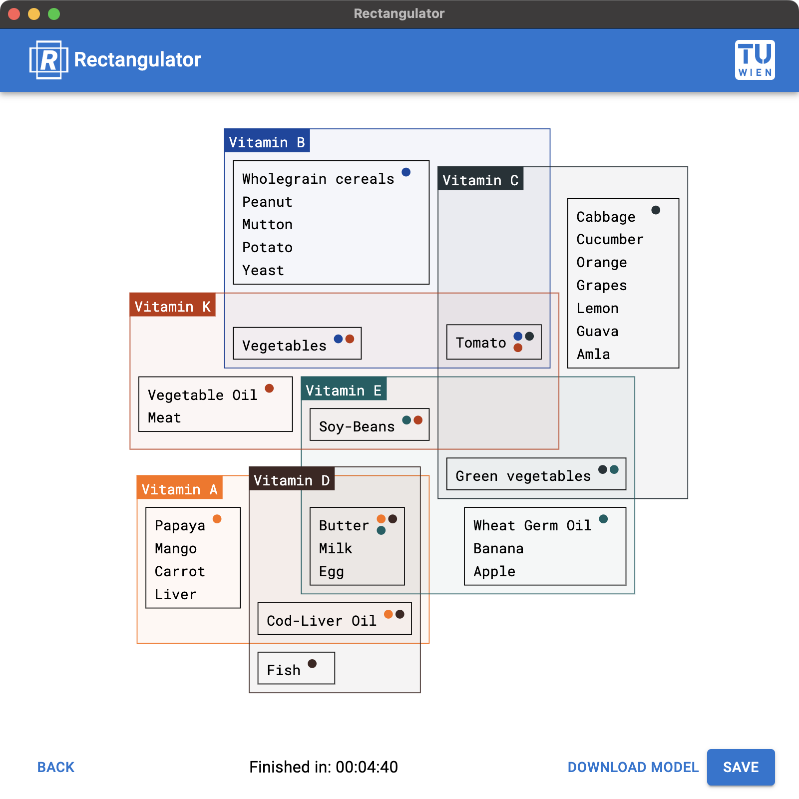

# Rectengular Sets Visualisation

## About the Project

This project implements rectangular Euler-like sets visualization described in the following paper and its supplementary:
* [Paper](https://graphics.uni-konstanz.de/publikationen/Paetzold2023RectEulerVisualizingIntersecting/Rectangular_Euler_Diagrams_preprint.pdf)
* [Supplementary](https://graphics.uni-konstanz.de/publikationen/Paetzold2023RectEulerVisualizingIntersecting/Rectangular_Euler_Diagrams_supp.pdf)

### High-level Design



### Additional Performance Optimizations

* We use hash tables to minimize duplications when computing intersections, exclusions, or caching constraints. To make sure constraints only appear once, we use sorted hashes.
* Label overlapping will likely occur on intersections, therefore we only compute label constraints for intersecting sets
* Exclusion constraints are only computed for parent-most sets to avoid creating unnecessary constraints, as group exclusion from the parent set automatically means exclusion from all child nodes

### Performance Evaluation

Although the project uses a highly efficient LP Solver HiGHS, it cannot achieve the same performance levels as commercial products.

Performance of the application highly depends on the complexity of the dataset. Optimization may be taking from seconds up to tens of minutes for highly intersecting sets.

We therefore introduce constraint toggles, to let the user decide which constraints to compute. This allows the user to trade-off between performance and accuracy.

### Feature Overview

**Home Screen**


**Preview Screen**



**Solution Screen**



## Setting Up Dev Environment

1. For simplicity, use [nvm](https://github.com/nvm-sh/nvm) to manage node versions. Recommended version is >= 18
2. Install yarn package manager: `npm install -g yarn`
3. Install project dependencies: `yarn install`
4. Run the project: `yarn start`

## Packaging the Project

To create project binaries simply run:

```bash
yarn package
```

You will find the binaries under the `build` folder.

## Adding new HiGHS binaries

At the moment the project offers two HiGHS binaries (can be found under `src/resources/binaries`):
1. `highs_darwin_arm64` for Apple Silicon (macOS)
2. `highs.wasm` - C++-based web assembly binary which is used as a fallback option

### Building a new HiGHS binary

> Note you will need `cmake` and `make` for the following steps

The actual platform-specific binary may be a little bit faster. You can therefore build and add a binary by yourself:
```bash
make build-highs
```

The binary (you will find it under `.tmp/HiGHS/build`) has to be placed under `src/resources/binaries` and added to the mapping in `src/models/solvers/highs.ts`.

### Testing and Developing components in isolation

```bash
yarn storybook
```
